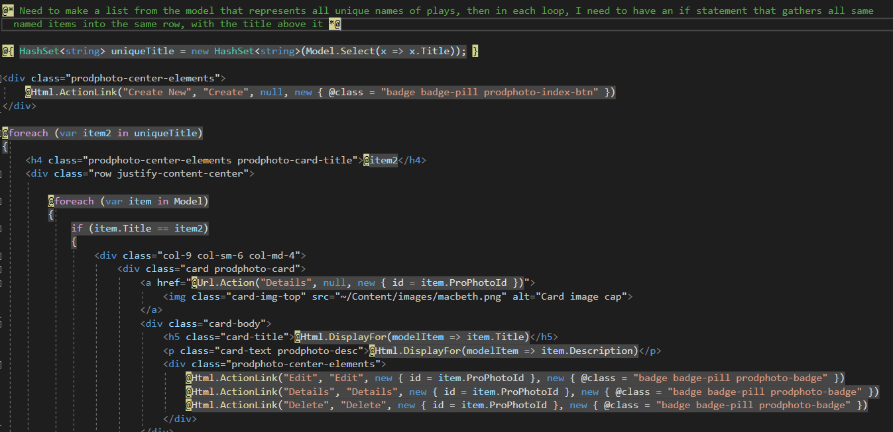
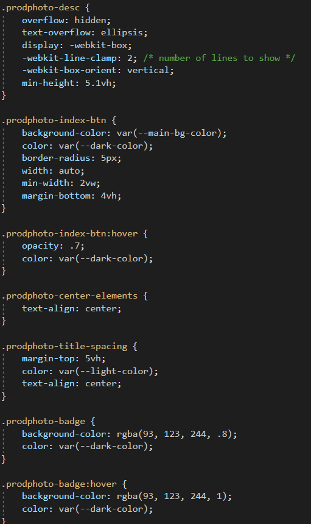

# C Sharp Two-Week Sprint - Overview

The end product of this overall project is to create an application for a local portland based theatre that is meant to be a content management site. The technologies we used on the project were C#, ASP.Net MVC, Entity Framework, SQLite, Git, Azure DevOps, Bootstrap and Visual Studio 2019. We used scrum as our team framework. 

I had 4 tasks completed within the sprint. I first needed to create a model, add a controller and scaffold in a database plus CRUD pages for the model. Secondly, I was tasked with creating a site-wide partial-view navbar, based on the color scheme of the website. Then my job was to style the create and edit pages. Lastly, I worked to set up the index page of my section to show all database items grouped by title name and styled well.

# Visual examples

Here is the index page, with cshtml and css below:

I used Bootstrap 4 cards with the grid layout for responsiveness and added my own styling

This shows me passing in a unique list that I loop through twice to sort out each card by title name

Here is some of my personal styling that I added to the Index page

The project's skeleton was already set up when I joined, however I created the model for my area and scaffolded it. Then, I styled the navbar, index page, create page, and the edit page, while the delete and details pages are unchanged. The index page also is fully responsive to screen size. I left much of the original scaffolded material, while adding on my own classes and bootstrap to make style changes. I also used a Hashset at the top to allow me to pass in the unique list of titles so that I could group each image together with those sharing a title name with it.

# 50 sec video walkthrough

Here is a 50 second video to walk through the entire website functionality:

I have only done a couple drills with EF and Razor pages before coming onto this project, so now I have come to a solid understanding of both and I could be of service to a team using those tools. As I finished the coding bootcamp with The Tech Academy here, I brought together what I learned of computer programming theory and 6 different coding languages and I see the results in my ability to learn quickly and push through frustration to get the job done.

Above all else, I improved my ability to debug and resolve problems, whether related to syntax, page styling, or researching coding methods. And these are certainly the most important skills to have as a developer, along with the desire to finish and resilience in the face of the constant frustration that coding is. 

# Skills learned

Dev skills learned:

- Function and styling of cshtml pages with Razor syntax
- Improved debugging using developer tools and inspecting method definition to resolve incorrect implementation
- Understanding of entity framework
- Thorough comprehension of how to properly use Git merging, pulling, updating and pushing of branches.
- Acquired the confidence to think logically like a developer and therefore be able to conceptually plan how to solve problems and think my way through roadblocks

Dev soft skills improved:

- High confidence in ability to smoothly communicate with team
- Improved ability to frame questions precisely to my team when needing help with my code

#PUT LINK TO OTHER README
