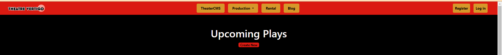
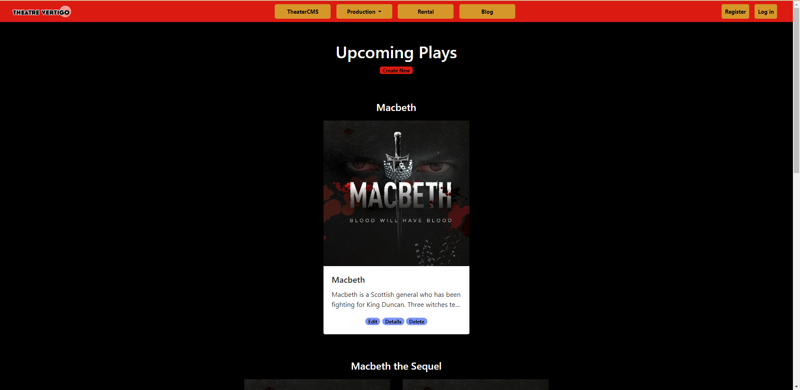

# ASP.NET MVC Project

The end product of this overall project is to create an application for a local portland based theatre that is meant to be a content management site. The technologies we used on the project were C#, ASP.Net MVC, Entity Framework, SQLite, Git, Azure DevOps, Bootstrap and Visual Studio 2019. We used scrum as our team framework. 

I had 4 tasks completed within the sprint. I first needed to create a model and use the code-first method to create a database. Then I needed to add a controller to scaffold the CRUD controllers and views. Secondly, I was tasked with creating a site-wide partial-view navbar, based on the color scheme of the website. Then my job was to style the create and edit pages. Lastly, I worked to set up the index page of my section to show all database items grouped by title name and styled well.

# Features I Added

Here I describe features I added for each story completed. Story one will have that description and its title will be a link to the code written for it. Each of these images for story 2-4 show the user-facing webpage display. The title of each story will be a link that will take you to the code that creates the page structure and styling. Below the links are bullet points that show features I added.

Story 1 - [Create Model and Scaffolding](CodeDetails/README.md#create-model-and-scaffolding)

Features added:

- Created a model
- Added model to dbcontext
- Created database off of the model and dbcontext using code-first technique
- Scaffolded CRUD views and controllers after database in place

Story 2 - [Make Site-Wide Navbar](CodeDetails/README.md#make-site-wide-navbar)

Features added:

- Created a partial view for the navbar and nested the login partial view inside it
- Nested the navbar in the main layout page of the site to have it shown on all webpages of the site
- Downloaded actual company icon from the original customer's site and displayed on navbar
- Created buttons that will be used for site navigation
- Styled navbar with website color scheme and aligned contents to look clean
- Made navbar responsive to screen size

Story 3 - [Style Create and Edit Pages](CodeDetails/README.md#style-create-and-edit-pages)

The create and edit pages look visually the same, so I only show the create page here

Features added:

- Added title section for clarity
- Styled buttons to look professional
- Added placeholders to form fields
- Aligned buttons and fields in the center of the form
- Aligned and resized form to fit scale of page

Story 4 - [Index Page: Sort Production Photots by Title](CodeDetails/README.md#index-page-sort-production-photos-by-title)

Features added:

- Added bootstrap card classes to contain each database object
- Styled form to fit with site color scheme and page size
- Styled buttons and fields to fit well inside each card
- Grouped each photo with the same title into separate sections
- Used bootstrap grid layout to make cards and page responsive

[Link to beginning of readme file with all my code](CodeDetails/README.md)

# 1 Minute Walkthrough of Site

Here is a 50 second video to walk through the entire website functionality:

<iframe width="560" height="315" src="https://www.youtube.com/embed/9qE95N85SFM" frameborder="0" allow="accelerometer; autoplay; clipboard-write; encrypted-media; gyroscope; picture-in-picture" allowfullscreen></iframe>

I have only done a couple drills with EF and Razor pages before coming onto this project. I started out fumbling and struggling to understand how the code first technique worked and how to interact with the database on those drills and eventually came to understand basically how it functions. Now, as I have worked through this project, I have come to a solid understanding of both as well as how to work with general MVC and I could be of service to a team using those tools. As I finished the coding bootcamp with The Tech Academy with this final project, I have seen the huge importance of learning the fundamentals of computer hardware, software and general principles. Because without that under my belt, I would have been struggling every step of the way on this project. Instead, I brought together what I learned of computer programming theory and 6 different coding languages and I see the results in my ability to learn quickly and push through frustration to get the job done in this project. 

Above all else, I improved my ability to debug and resolve problems, whether related to syntax, page styling, or researching coding methods. And these are certainly the most important skills to have as a developer, along with the desire to finish and resilience in the face of the constant frustration that coding is. I have confidence that I now can function in the workforce. This is true because I am aware of how much I don't know about computer programming, but I know that I can pick up new concepts quickly and I can communicate with my team and debug my way to solve the many problems I will encounter.

# Skills learned

Dev skills learned:

- Function and styling of cshtml pages with Razor syntax
- Improved debugging using developer tools and inspecting method definition to resolve incorrect implementation
- Understanding of entity framework
- Thorough comprehension of how to properly use Git merging, pulling, updating and pushing of branches.
- Acquired the confidence to think logically like a developer and therefore be able to conceptually plan how to solve problems and think my way through roadblocks

Dev soft skills improved/gained:

- High confidence in ability to smoothly communicate with team
- Improved ability to frame questions precisely to my team when needing help with my code
- Ability to gracefully accept feedback
- Very easy to work with and highly coachable
