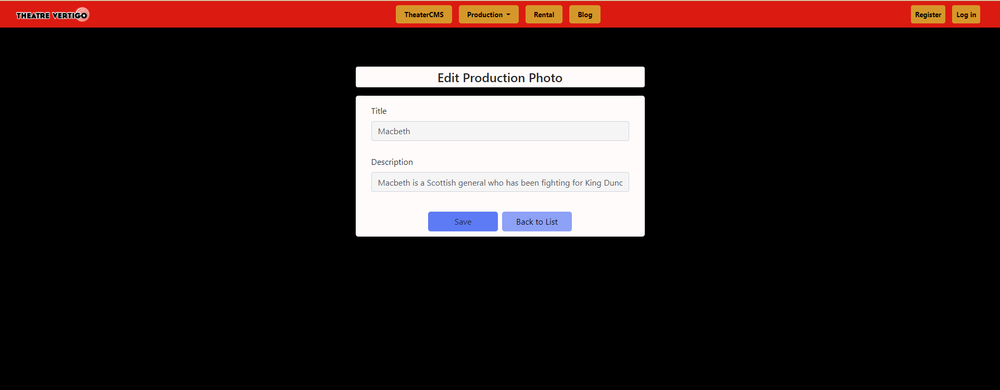

# ASP.NET MVC Project

The end product of this overall project is to create an application for a local portland based theatre that is meant to be a content management site. The technologies we used on the project were C#, ASP.Net MVC, Entity Framework, SQLite, Git, Azure DevOps, Bootstrap and Visual Studio 2019. We used scrum as our team framework. 

I had 4 tasks completed within the sprint. I first needed to create a model and use the code-first method to create a database. Then I needed to add a controller to scaffold the CRUD controllers and views. Secondly, I was tasked with creating a site-wide partial-view navbar, based on the color scheme of the website. Then my job was to style the create and edit pages. Lastly, I worked to set up the index page of my section to show all database items grouped by title name and styled well.

[Link to model/scaffolding story](CodeDetails/README.md#create-model-and-scaffolding)

# Visual examples

Navbar - [Navbar code](CodeDetails/README.md#make-site-wide-navbar)

Edit Page - [Edit page code](CodeDetails/README.md#create-model-and-scaffolding)

Create Page - [Create page code](CodeDetails/README.md#style-create-and-edit-pages)

Index Page - [Index page code](CodeDetails/README.md#index-page-sort-production-photos-by-title)

[Link to beginning of readme file with all my code](CodeDetails/README.md)

# 1 Minute Walkthrough of Site

Here is a 50 second video to walk through the entire website functionality:

I have only done a couple drills with EF and Razor pages before coming onto this project, so now I have come to a solid understanding of both and I could be of service to a team using those tools. As I finished the coding bootcamp with The Tech Academy with this final project, I brought together what I learned of computer programming theory and 6 different coding languages and I see the results in my ability to learn quickly and push through frustration to get the job done.

Above all else, I improved my ability to debug and resolve problems, whether related to syntax, page styling, or researching coding methods. And these are certainly the most important skills to have as a developer, along with the desire to finish and resilience in the face of the constant frustration that coding is. 

# Skills learned

Dev skills learned:

- Function and styling of cshtml pages with Razor syntax
- Improved debugging using developer tools and inspecting method definition to resolve incorrect implementation
- Understanding of entity framework
- Thorough comprehension of how to properly use Git merging, pulling, updating and pushing of branches.
- Acquired the confidence to think logically like a developer and therefore be able to conceptually plan how to solve problems and think my way through roadblocks

Dev soft skills improved/gained:

- High confidence in ability to smoothly communicate with team
- Improved ability to frame questions precisely to my team when needing help with my code
- Ability to gracefully accept feedback
- Very easy to work with and highly coachable

